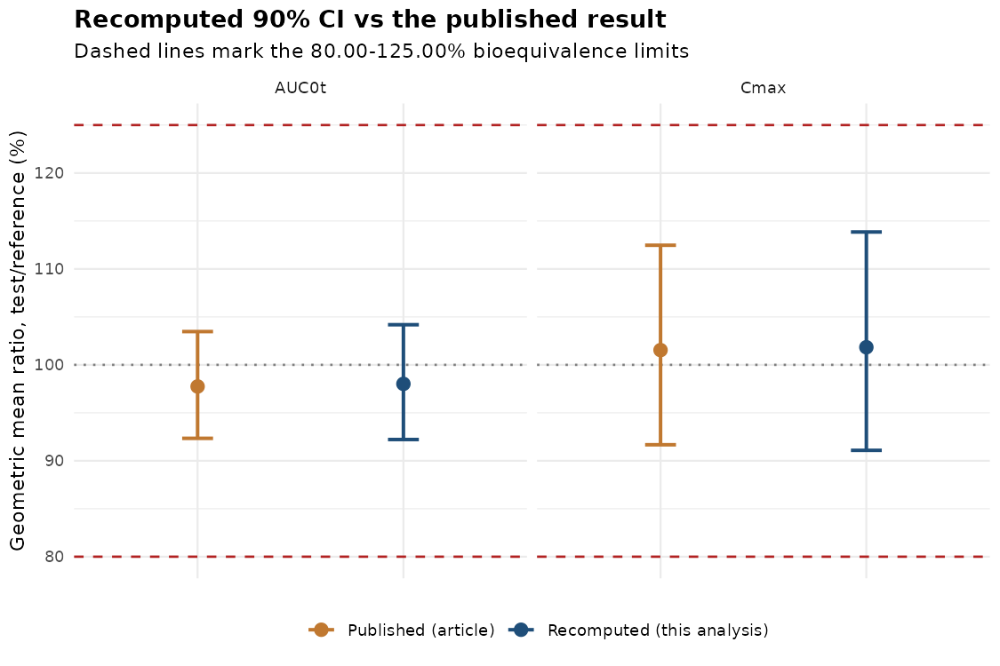
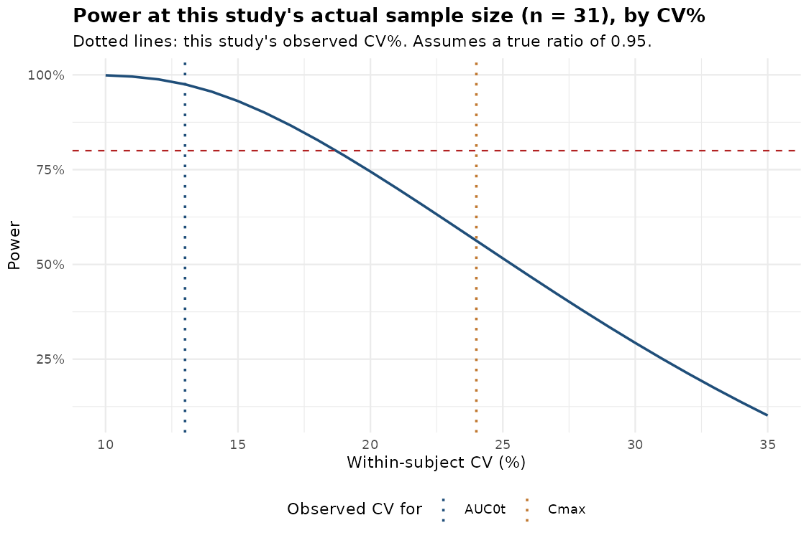

# Bioequivalence of Two Methocarbamol Formulations: An Independent Recomputation

Can you reproduce a published bioequivalence result using nothing but the
numbers printed in the paper? This project tries, on a real generic-drug
crossover study, using the same statistical method regulators require.

**[Read the full report](https://krimapatel1505.github.io/be-crossover-analysis/)**

---

## The question

A bioequivalence submission lives or dies by one number: a 90% confidence
interval on the ratio of test to reference exposure, which has to sit
inside 80.00-125.00%. Before that table goes anywhere, someone checks it.
Given only the means and the within-subject variability a study reports,
does the confidence interval in the table actually follow from the
standard calculation?

This project runs that check against a real, open-access, peer-reviewed
bioequivalence trial: a 2025 two-sequence, two-period crossover study of a
generic methocarbamol 1500 mg tablet against Robaxin, in 31 subjects.

## What it found

Working from nothing but the reported geometric means and within-subject
CV%, an independent, from-scratch implementation of the standard 2x2x2
crossover formula reproduces the published 90% CI to within about a
percentage point for both AUC0-t (recomputed 92.22-104.18% vs published
92.34-103.47%) and Cmax (91.09-113.85% vs 91.67-112.47%).



Both intervals land inside 80.00-125.00% either way, so the bioequivalence
conclusion does not change. But the gap is not zero, and it is not the
same size for both parameters, which is the more interesting part. The
article reports within-subject CV as a whole percentage point (24% for
Cmax, 13% for AUC0-t). A one-point rounding difference in that CV feeds
directly into the width of the confidence interval, and it matters more
for the parameter with the larger CV. That is exactly the pattern here:
the AUC0-t interval, built on a smaller CV, reproduces almost exactly; the
Cmax interval, built on a larger CV, comes back visibly wider. Anyone
checking a bioequivalence table from a published summary rather than the
sponsor's own ANOVA output should expect exactly this: close, not
identical.

A second, independent question follows from the same numbers: was this
study actually well powered? Cmax and AUC0-t do not have the same
variability, so the same sample size does not give them the same power.



At its observed AUC0-t variability, the study's 31 subjects gave it
strong power (about 98%, assuming a true ratio of 0.95). At its observed
Cmax variability, the same 31 subjects gave meaningfully less power
(about 56%). The formulations happened to be close enough that Cmax
passed anyway, but a study this size was not reliably powered to catch a
smaller, still-passing difference in Cmax specifically. This is exactly
why bioequivalence guidance tells sponsors to size a crossover study
around its most variable endpoint, not its average one, and it is
something the published article's summary tables do not show on their
own.

## Method

| Step | Approach |
|---|---|
| Input data | Geometric means, arithmetic means, and within-subject CV% for Cmax and AUC0-t, exactly as reported in the source article |
| GMR and 90% CI | Log-transformed two-sample formula (Schuirmann's TOST, as specified in FDA/EMA bioequivalence guidance), implemented from its statistical definition |
| Validation | Recomputed CI compared directly against the article's own published CI |
| Power / sample size | Noncentral-t approximation to TOST power, used to compute achieved power at the study's actual n and the sample size needed for 80% power across a range of assumed true ratios |

No individual-subject data are used anywhere in this project. See why
below.

## Data

- **Source study**: Portoles-Perez A, et al. *Bioequivalence Study of Two
  Oral Methocarbamol Formulations in Healthy Subjects Under Fasting
  Conditions: A Randomized, Open-Label, Crossover Clinical Trial.*
  Pharmaceuticals. 2025;18(3):354. DOI:
  [10.3390/ph18030354](https://doi.org/10.3390/ph18030354). Open access
  (CC BY).

Bioequivalence trials do not publish individual-subject data, even in
fully open-access journals; this is standard practice, not a limitation
specific to this study (patient-level PK data are protected health
information, and this article, like others checked while building this
project, states that underlying data are available from the corresponding
author on request, not in the paper itself). What every published trial
does report is a set of summary statistics, and those are what a
biostatistician actually works from when spot-checking a submission table
against a journal article or a public assessment report. That is the
scenario this project reproduces.

Full transcription, exact source values, and the search across several
other 2024-2025 crossover bioequivalence publications that confirmed this
pattern are documented in
[`data/DATA_PROVENANCE.md`](data/DATA_PROVENANCE.md).

## Repository structure

```
├── data/
│   ├── raw/                          transcribed summary statistics (CSV)
│   └── DATA_PROVENANCE.md            source, design, transcription notes
├── R/
│   ├── utils.R                       GMR/CI math, power, sample size
│   ├── 01_load_data.R                loading and integrity checks
│   ├── 02_be_analysis.R              recomputation vs published CI
│   └── 03_power_sensitivity.R        power and sample-size sensitivity
├── analysis/
│   └── be_crossover_report.Rmd       the full report source
├── docs/index.html                   GitHub Pages copy of the report
├── outputs/
│   ├── be_crossover_report.html      rendered report
│   ├── figures/                      three figures
│   └── tables/                       three result tables (CSV)
├── run_all.R                         runs the pipeline, writes outputs
├── render_report.R                   renders the report, publishes docs/index.html
└── sessionInfo.txt                   package versions used
```

## Reproducing

Requires R (developed on 4.3.3) with `dplyr`, `tidyr`, `ggplot2`, `scales`,
`knitr` and `rmarkdown`.

```bash
Rscript run_all.R        # analysis, figures, result tables
Rscript render_report.R  # renders the report to outputs/ and docs/index.html
```

`run_all.R` asserts the data-integrity checks and will stop rather than
produce output if a transcription check fails.

## Tools

R, dplyr, tidyr, ggplot2, R Markdown. The underlying method (log-scale
ANOVA, Schuirmann's TOST, noncentral-t power) is the same one implemented
in Phoenix WinNonlin, SAS PROC GLM, and R's PowerTOST; it is written here
directly from its statistical definition, in open-source R, so every step
is inspectable.

## References

1. Portoles-Perez A, et al. Bioequivalence Study of Two Oral Methocarbamol
   Formulations in Healthy Subjects Under Fasting Conditions: A
   Randomized, Open-Label, Crossover Clinical Trial. *Pharmaceuticals.*
   2025;18(3):354. DOI: 10.3390/ph18030354
2. US FDA. *Statistical Approaches to Establishing Bioequivalence.*
   Guidance for Industry, 2001.
3. EMA. *Guideline on the Investigation of Bioequivalence.*
   CPMP/EWP/QWP/1401/98 Rev. 1/Corr, 2010.
4. Diletti E, Hauschke D, Steinijans VW. Sample size determination for
   bioequivalence assessment by means of confidence intervals. *Int J
   Clin Pharmacol Ther Toxicol.* 1991;29(1):1-8.

## License

MIT (code). The source article is CC BY (open access); see its DOI for
full terms.
